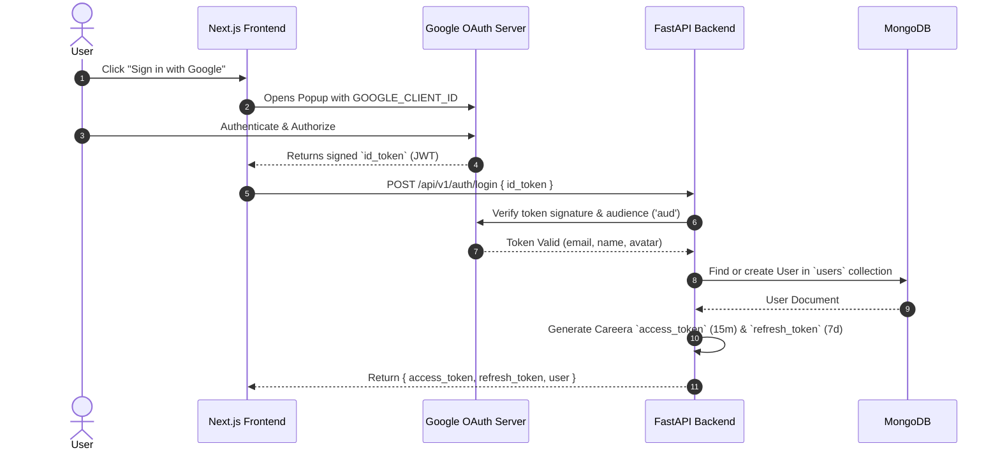

# 🔐 Google OAuth & Authentication Guide

This guide explains how authentication works in Careera, how Google Cloud OAuth 2.0 synchronizes with the Frontend and Backend, and provides step-by-step instructions for configuring Google Cloud credentials.

---

## 1. Authentication Architecture Overview

Careera uses **Google OAuth 2.0 (OpenID Connect)** for user identity, and **JWT (JSON Web Tokens)** for stateless API sessions:



---

## 2. Key Concepts Explained

### A. OAuth Consent Screen vs. Client ID
In Google Cloud Console, authentication settings are split into two parts:

| Component | What it is | Purpose |
|---|---|---|
| **OAuth Consent Screen** | The **Brand Identity** (1 per project) | What users see in the popup: your app name (*Careera*), logo, support email, and requested permissions (`email`, `profile`). |
| **OAuth Client ID** | The **Technical Platform Connector** | Identifies the specific platform (Web, iOS, Android) connecting to your Google Cloud Project. |

> **Why they are separated:** A single Careera project can have multiple Client IDs (e.g., Web App and Mobile App) while sharing the exact same Brand Consent Screen.

---

### B. Client ID vs. Client Secret

| Property | `GOOGLE_CLIENT_ID` | `GOOGLE_CLIENT_SECRET` |
|---|---|---|
| **Visibility** | **Public** | **Private / Secret** |
| **Where it lives** | Frontend (`.env.local`) + Backend (`.env`) | Backend only (`.env`) |
| **Role** | Identifies your app to Google and verifies token audience (`aud`). | Used by the backend for secure server-to-server code exchanges. |

---

### C. How Synchronization Works

The **`GOOGLE_CLIENT_ID` string** is the single shared key that synchronizes Google, the Frontend, and the Backend:

1. **Frontend** uses `GOOGLE_CLIENT_ID` so Google knows which app is requesting login.
2. **Google** issues an `id_token` stamped with `"aud": "YOUR_CLIENT_ID"`.
3. **Backend** verifies that the token's `"aud"` matches its own `GOOGLE_CLIENT_ID`. If they match, the token is guaranteed to be authentic and issued specifically for Careera.

---

## 3. Step-by-Step Google Cloud Setup

Follow these steps to generate your Google OAuth credentials:

### Step 1: Create a Google Cloud Project
1. Open the [Google Cloud Console](https://console.cloud.google.com/).
2. Click the project dropdown in the top-left and select **New Project**.
3. Name it `Careera-Dev` (or your preferred name) and click **Create**.

---

### Step 2: Configure the OAuth Consent Screen
1. In the left navigation, go to **APIs & Services > OAuth consent screen**.
2. Select **External** and click **Create**.
3. Fill in the required fields:
   - **App name**: `Careera`
   - **User support email**: Select your Google email.
   - **Developer contact information**: Enter your email.
4. Click **Save and Continue**.
5. On the **Scopes** page, click **Add or Remove Scopes**, check `.../auth/userinfo.email` and `.../auth/userinfo.profile`, then click **Update** and **Save and Continue**.
6. On the **Test users** page, add your personal Google email address (required while the app is in "Testing" mode), then click **Save and Continue**.

---

### Step 3: Create OAuth 2.0 Client ID Credentials
1. In the left navigation, go to **APIs & Services > Credentials**.
2. Click **+ CREATE CREDENTIALS** at the top and select **OAuth client ID**.
3. Fill in the settings:
   - **Application type**: `Web application`
   - **Name**: `Careera Web Client`
   - **Authorized JavaScript origins**:
     - `http://localhost:3000` (Local Next.js Frontend)
     - `http://localhost:8000` (Local FastAPI Backend / Swagger Docs)
   - **Authorized redirect URIs**:
     - `http://localhost:3000/api/auth/callback/google`
     - `http://localhost:8000/docs/oauth2-redirect`
4. Click **Create**.
5. A modal will appear showing your **Client ID** and **Client Secret**.

---

### Step 4: Add Keys to Environment Files

#### Backend (`backend/.env`):
```env
GOOGLE_CLIENT_ID=1234567890-abcdefg.apps.googleusercontent.com
GOOGLE_CLIENT_SECRET=GOCSPX-your-client-secret
SECRET_KEY=your-custom-jwt-secret-key
ACCESS_TOKEN_EXPIRE_MINUTES=15
REFRESH_TOKEN_EXPIRE_DAYS=7
```

#### Frontend (`frontend/.env.local`):
```env
NEXT_PUBLIC_API_URL=http://localhost:8000/api/v1
NEXT_PUBLIC_GOOGLE_CLIENT_ID=1234567890-abcdefg.apps.googleusercontent.com
```

---

## 4. Local Development Without Google Credentials (Dev Mode)

During backend development, you don't need Google credentials to test authentication. You can use the built-in dev bypass endpoint:

```bash
# Instant login / user creation without Google OAuth:
POST /api/v1/auth/login/dev?email=dev@test.com&name=Test%20Developer
```

This returns valid Careera `access_token` and `refresh_token` pair that you can use immediately for all protected routes!

---

## 5. Token Lifecycles & Security

- **Access Tokens (`15 min`)**: Attached to API requests in `Authorization: Bearer <access_token>`.
- **Sliding Refresh Tokens (`7 days`)**: `POST /api/v1/auth/refresh` exchanges a valid refresh token for a new `access_token` AND a new rotated `refresh_token`. The old refresh token is blacklisted. Users remain logged in unless inactive for 7 consecutive days.
- **Logout Revocation (`POST /api/v1/auth/logout`)**: Accepts `{ "refresh_token": "..." }` and blacklists both the active access token and refresh token in MongoDB `refresh_tokens`. MongoDB's **TTL index** automatically deletes expired records.

