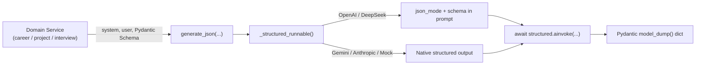
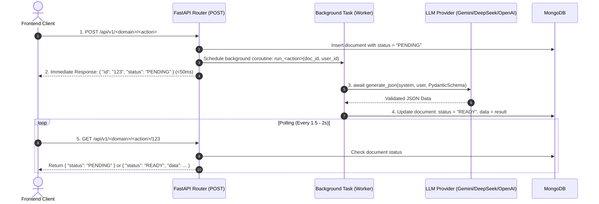

# 🤖 LLM Integration Guide

Careera provides a **provider-agnostic, async LLM generation layer** built on top of [LangChain](https://python.langchain.com/) and [Pydantic v2](https://docs.pydantic.dev/).

It allows developers to write LLM tasks once and switch seamlessly between offline mock responses (zero cost) and production cloud providers (Gemini, DeepSeek, OpenAI, Anthropic).

---

## ⚡ Quick Start: Using LLM in Services

Every LLM call in Careera follows a standard 3-step pattern using [`generate_json()`](../backend/app/share/service/llm/__init__.py):

```python
from pydantic import BaseModel, Field
from app.share.service.llm import generate_json

# 1. Define the target JSON structure with Pydantic
class ProfileAnalysisOutput(BaseModel):
    summary: str = Field(description="2-3 sentence overview of candidate profile")
    hard_skills: list[str] = Field(default_factory=list)
    match_score: int = Field(ge=0, le=100)

# 2. Call generate_json asynchronously
async def analyze_profile(cv_text: str) -> dict:
    result = await generate_json(
        system="You are an expert technical career counselor.",
        user=f"Analyze this CV:\n{cv_text}\nReturn JSON matching the 'career analysis' schema.",
        response_model=ProfileAnalysisOutput,
    )
    
    # 3. Use the guaranteed valid dictionary (ready for MongoDB)
    # result = {"summary": "...", "hard_skills": ["Python", "FastAPI"], "match_score": 92}
    return result
```

---

## 🏗️ How It Works



### Key Guarantees:
1. **Fully Async (`ainvoke`)**: Never blocks FastAPI's event loop during long generation calls.
2. **Strict Schema Validation**: Responses are validated against the Pydantic model before returning. If the LLM generates invalid data, an [`LLMProviderError`](../backend/app/share/service/llm/exceptions.py) is raised.
3. **Provider Compatibility**: Normalizes API differences across vendors (e.g. automatically handling DeepSeek's `json_mode` requirements).

---

## ⏳ Async Execution: Background Tasks & Polling Lifecycle

Because LLM generation across large prompts (career roadmaps, CV synthesis, node expansions, coding grading) can take **5 to 20 seconds**, endpoints that trigger LLM calls must **never make the client wait synchronously**.

Instead, all heavy LLM features in Careera use FastAPI's **`BackgroundTasks` + Polling pattern**:



### Standard Implementation Recipe for All LLM Features:

#### 1. Router Endpoint (`POST /...`):
```python
@router.post("/analyze", response_model=AnalyzeResponse, status_code=200)
async def create_analysis(
    background_tasks: BackgroundTasks,
    current_user: dict = Depends(get_current_user),
):
    # Inserts PENDING document & schedules background task
    return await analysis_service.create_analysis(
        user_id=current_user["user_id"],
        background_tasks=background_tasks,
    )
```

#### 2. Service Background Worker:
```python
async def run_analysis(analysis_id: str, user_id: str):
    try:
        # Await LLM asynchronously without blocking the server
        result = await generate_json(system=..., user=..., response_model=...)
        
        # Persist final READY status and parsed data
        await db.analyses.update_one(
            {"_id": ObjectId(analysis_id)},
            {"$set": {"status": "READY", "result": result}}
        )
    except Exception as exc:
        # Graceful failure handling
        await db.analyses.update_one(
            {"_id": ObjectId(analysis_id)},
            {"$set": {"status": "FAILED", "error": str(exc)}}
        )
```

---

## ⚙️ Environment Configuration

Configure the provider in `backend/.env`:

| Variable | Required | Default | Description |
|---|---|---|---|
| `LLM_PROVIDER` | No | `mock` | `mock` \| `gemini` \| `deepseek` \| `openai` \| `anthropic` |
| `LLM_API_KEY` | When not `mock` | `""` | API key for the selected cloud provider |
| `LLM_MODEL` | No | *Provider default* | Model override (e.g. `gemini-1.5-flash`, `deepseek-chat`) |
| `LLM_URL` | No | `""` | Base URL override (useful for DeepSeek proxies or local Ollama) |

### Setup Examples

#### 1. Local Development (Default — Zero Cost, No API Key)
```env
LLM_PROVIDER=mock
```

#### 2. Google Gemini (Fast & Cost-Effective — Default)
```env
LLM_PROVIDER=gemini
LLM_API_KEY=AIzaSy...
LLM_MODEL=gemini-3.6-flash
```

#### 3. DeepSeek (Low-Cost)
```env
LLM_PROVIDER=deepseek
LLM_API_KEY=sk-...
LLM_MODEL=deepseek-chat
LLM_URL=https://api.deepseek.com
```

#### 4. Local Ollama / Self-Hosted
```env
LLM_PROVIDER=openai
LLM_API_KEY=ollama
LLM_URL=http://localhost:11434/v1
LLM_MODEL=llama3
```

---

## 🧪 Adding Mock Data for New Features

When building a new domain feature (e.g., Feature 4 Project Grading or Feature 5 Interview Questions), register a mock response so your feature works offline without API keys:

1. Open [`backend/app/share/service/llm/mock.py`](../backend/app/share/service/llm/mock.py).
2. Add your canned JSON factory function:
   ```python
   def _project_evaluation() -> dict[str, Any]:
       return {
           "status": "PASSED",
           "score": 85,
           "feedback": "Clean modular code with solid test coverage."
       }
   ```
3. Register your trigger keyword in `_PROMPT_MARKERS`:
   ```python
   _PROMPT_MARKERS: dict[str, Callable[[], dict[str, Any]]] = {
       "career analysis": _career_analysis,
       "career path": _career_path,
       "project evaluation": _project_evaluation,  # ← Added marker
   }
   ```
4. Include that keyword phrase in your service's user or system prompt.

---

## 🚦 Testing: Unit Tests vs. Live Integration Tests

Careera provides two testing tiers configured via `backend/pytest.ini`:

| Tier | Command | Speed & Cost | What it Does |
|---|---|---|---|
| **Unit Tests** *(Default)* | `poetry run pytest` | ⚡ **~1–2s** / **$0.00** | Uses in-memory `MockChatModel` & `FakeDB`. Runs 100% offline with zero API keys. `pytest.ini` automatically ignores integration tests by default. |
| **Live Integration Tests** | `poetry run pytest -m integration -s` | ⏳ **~10–15s** / Real Quota | Sends real HTTPS requests to the configured cloud provider (`LLM_PROVIDER`), parses output against Pydantic blueprints, and saves the live JSON to `backend/integration_results/career_analysis_live.json`. |

### Running the Live Integration Test:
```bash
# 1. Ensure LLM_PROVIDER and LLM_API_KEY are set in backend/.env
# (e.g. gemini, deepseek, openai, or anthropic)

# 2. Run the integration test:
poetry run pytest -m integration -s

# 3. View the generated live JSON result:
cat backend/integration_results/career_analysis_live.json
```

### Domain LLM Calls to Test:

| Feature Area | Call Type | Trigger Marker | Response Blueprint | Description |
|---|---|---|---|---|
| **Career Analysis** *(Feature 2)* | Analysis Generation | `"career analysis"` | `AnalysisLLMOutput` | CV & LinkedIn synthesis, skill gap matching, ranked career directions. |
| **Career Roadmap** *(Feature 2)* | Path Generation | `"career path"` | `CareerPathLLMOutput` | Multi-step milestone graph (learning, project, and interview nodes). |
| **Node Expansion** *(Feature 3)* | Learning Content | `"learning template"` | `LearningTemplateLLMOutput` | Curriculum, key concepts, reading guides, and curated resources. |
| **Node Expansion** *(Feature 3)* | Project Boilerplate | `"project template"` | `ProjectTemplateLLMOutput` | Task breakdown, subtask acceptance criteria, and model solution. |
| **Node Expansion** *(Feature 3)* | Interview Questions | `"interview template"` | `InterviewTemplateLLMOutput` | Technical question sequences, grading rubric, and model answers. |
| **Project Session** *(Feature 4)* | Code Evaluation | `"project evaluation"` | `ProjectEvaluationOutput` | Automated grading, criteria verification, pass/fail status, and line-by-line feedback. |
| **Interview Session** *(Feature 5)* | Answer Evaluation | `"interview evaluation"` | `InterviewEvaluationOutput` | Real-time answer scoring, clarity evaluation, and constructive feedback. |

